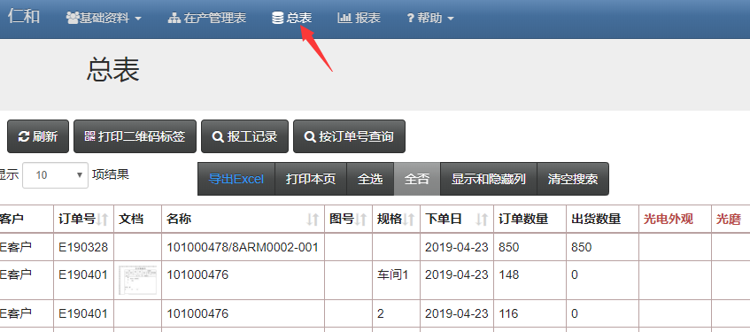
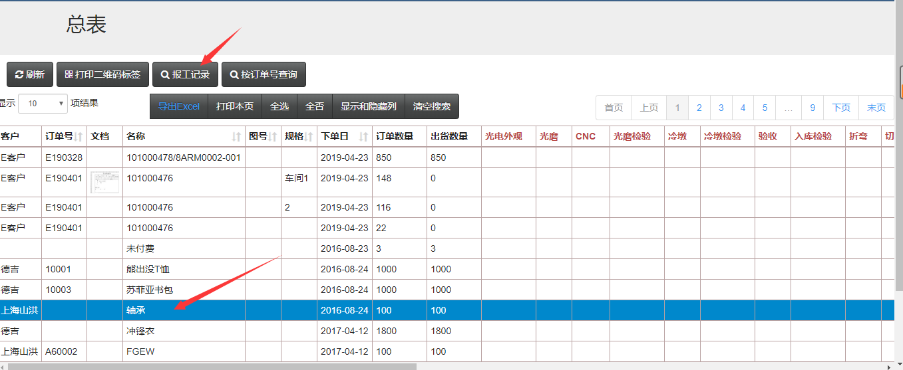
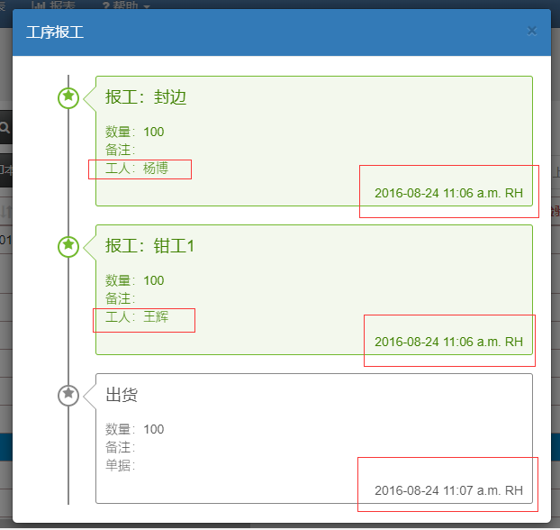
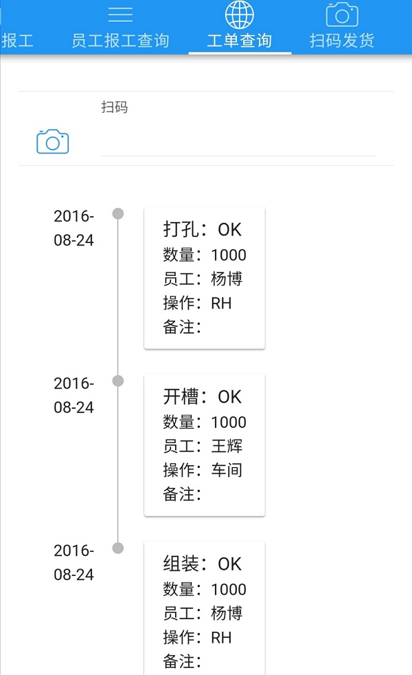

## 用一个二维码追溯从发货到生产过程

> 速易天工V3生产管理系统具有追溯从发货到生产过程的功能，电脑和手机APP都可以实现

> 电脑上的操作

- 进入“总表”页面

- 选择需要追溯的订单，点击“报工记录”菜单

- 会弹出报工记录的历史信息，显示了出货和生产情况

> 手机APP的操作

- 打开手机APP并登陆，点击工单查询，再点击照相机图标进行扫码

- 扫码后会出现历史记录

