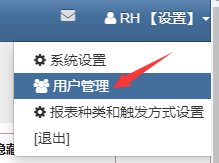

## 让客户自己查看订单进度

### 首先做一些准备工作

#### 新增客户的账号，供客户登录使用：

- 点击设置-用户管理

- 进入用户管理页面后，点击“添加新用户”，编辑用户信息

- 添加用户后，分配一下权限，是的其能看到在产管理表，但是不能编辑

- 接下来给这个账号分配一下只能看到自己的订单，在基础基料-工站岗位分配页面设置

- 找到对应的账号名字，分配“查看相关客户的单子（多选）”权限，并保存一下

