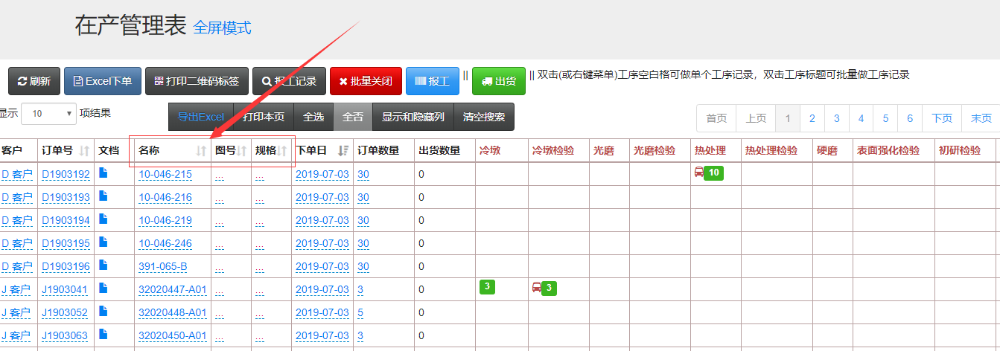

---
layout: default
title: 生产进度表的自定义
nav_order: 1
parent: 定义类似于Excel的生产进度表
---

# 生产进度表的自定义

V3的在产管理表类似于excel，可以自定义的修改、增加表头内容。

- 在设置-系统设置-订单页面

- 其中订单的额外字段可以自定义添加，用来表示订单信息的表头，一共可以添加20个。添加后记得要保存一下哈。

- 然后在产管理表的表头就会发生变化了。切换到在产管理表可以看一下。

这就是在产管理表的自定义方法。
