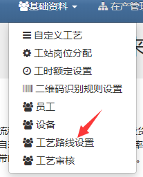
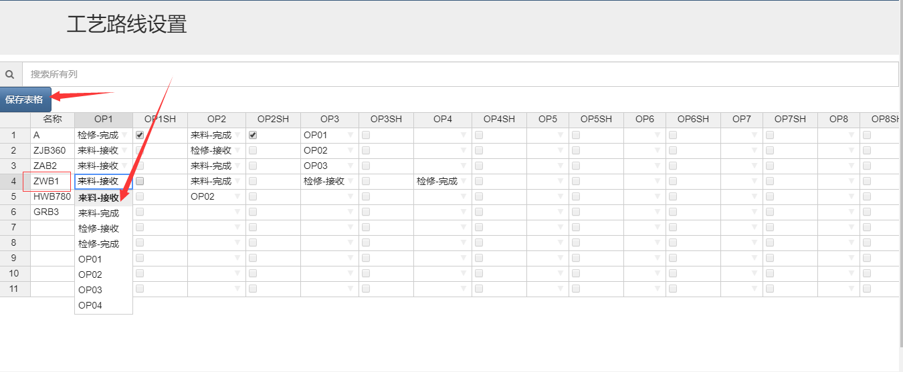
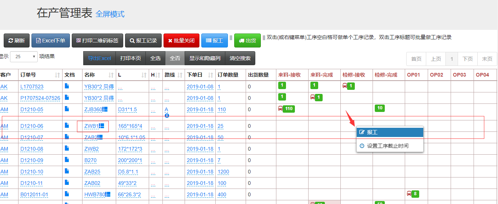
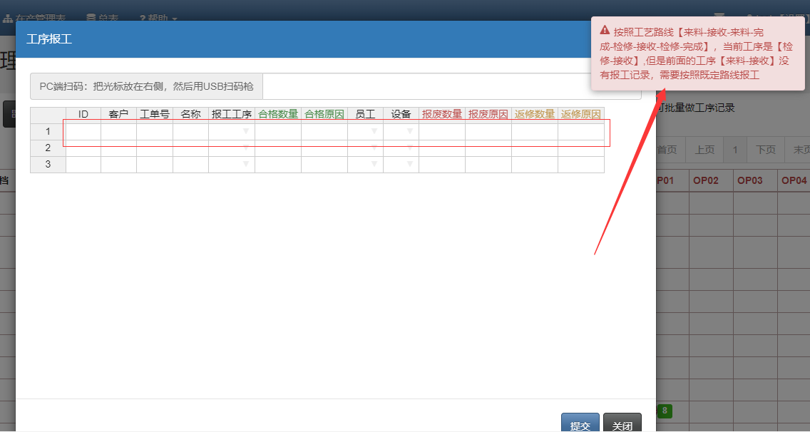
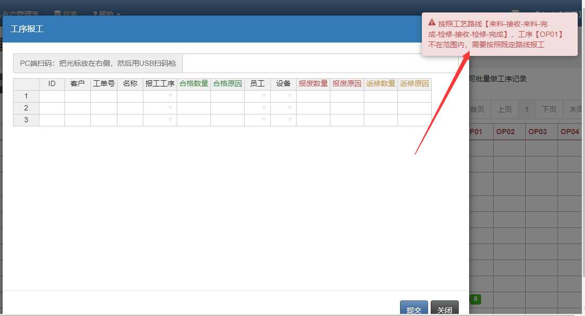

## 指定加工路线（需要另加模块）

速易天工V3生产管理系统，在系统原有的基础上可以额外增加工艺路线设定的功能，即：能够控制员工报工的顺序和范围。从而控制人为报工出错的可能性

- 首先做一下加工工艺路线的设置，点击基础基料-工艺路线设置

- 进入页面后，输入要设置工艺路线的名称，然后选择工艺，设置好后记得保存一下

- 然后回到在产管理表，举个例子，没有按顺序报工，报工“检修-接收”工艺，这是系统会提示错误并阻止报工。

- 或者报工超出范围的，也会提示出错并阻止

