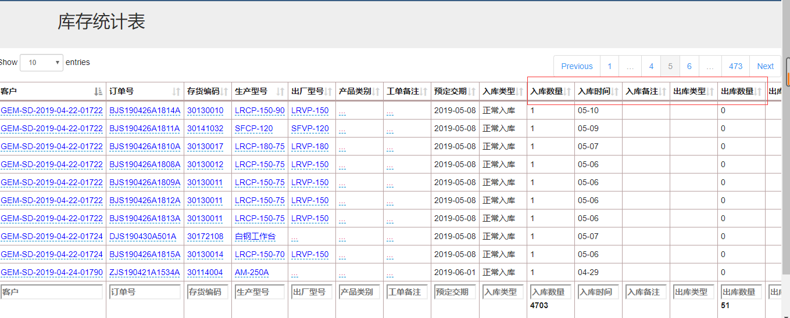
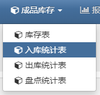
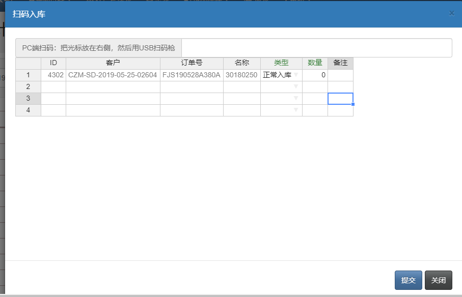
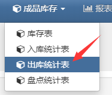
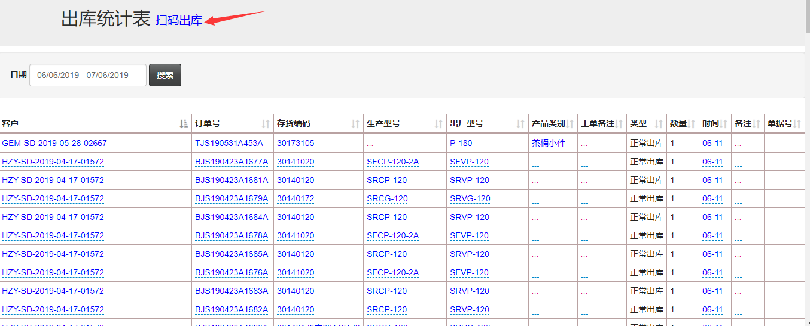

## 产品库存管理（需要另加模块）

速易天工V3生产管理系统，在原有的基础上，还可以选择增加库存管理的模块。此模块可以实现对成品的扫码出入库、库存的统计。

- 库存表，点击产品库存-库存表，可以查看出入库的统计，库存量的统计

- 入库统计表，点击产品库存-入库统计表，来到页面可以看到入库的统计记录；点击“扫码入库”还可以进行扫码入库的操作

- 点击“扫码入库”，会弹出入库编辑框，扫码，编辑入库类型，确认数量后点击提交

- 出库统计表，点击产品库存-出库统计表，在此页面可以查询出货记录明细，可以扫码出库操作

- 点击“扫码出库”，会弹出出库编辑框，扫码，编辑出库类型，确认数量后点击提交

