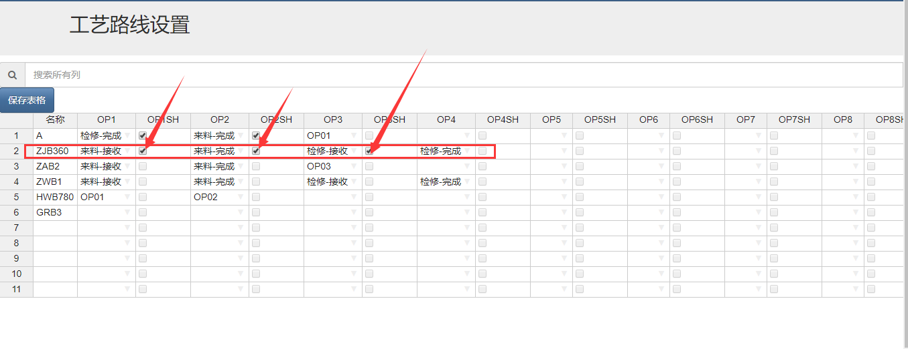
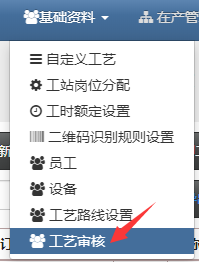
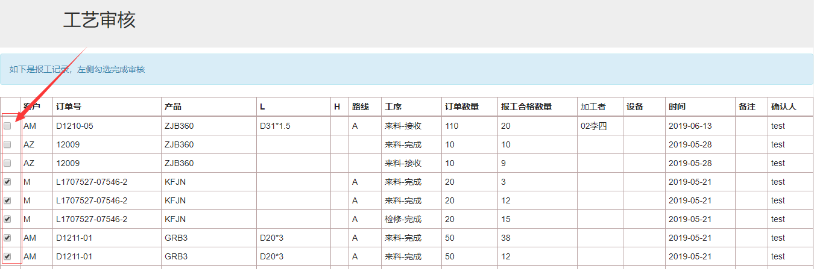
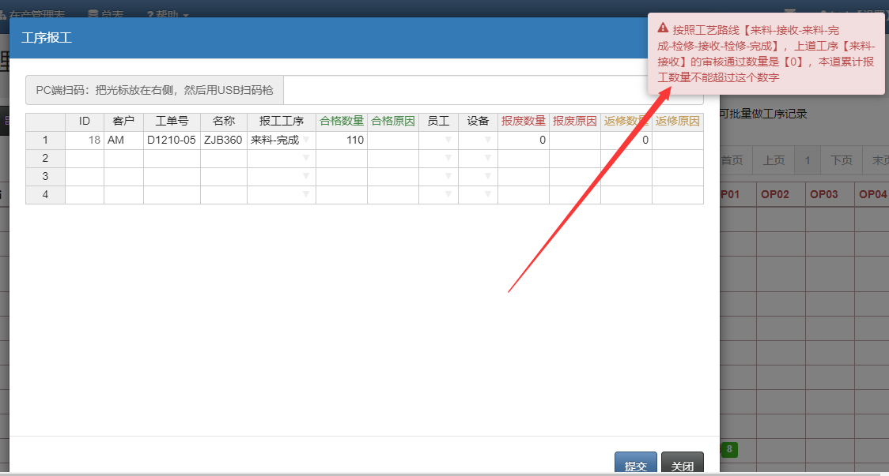

## 工艺路线审核（需要加模块）

速易天工V3生产管理系统，支持工艺审核，通过设置，可以单独指定某个工艺是否需要审核，只有审核后才能开始下道工艺的报工。

- 首先需要在工艺路线设置页面指定哪些工序需要审核，方法是打√的方式，在工艺后面有个勾选框，√代表需要审核，同样不要忘了保存一下。

- 然后点击基础资料-工艺审核，来到工艺审核页面，左边有勾选框，打钩代表通过审核了，反之没有审核

- 如果没有审核，员工进行报工，将会阻止

