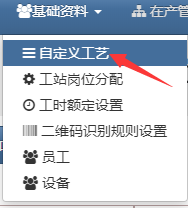
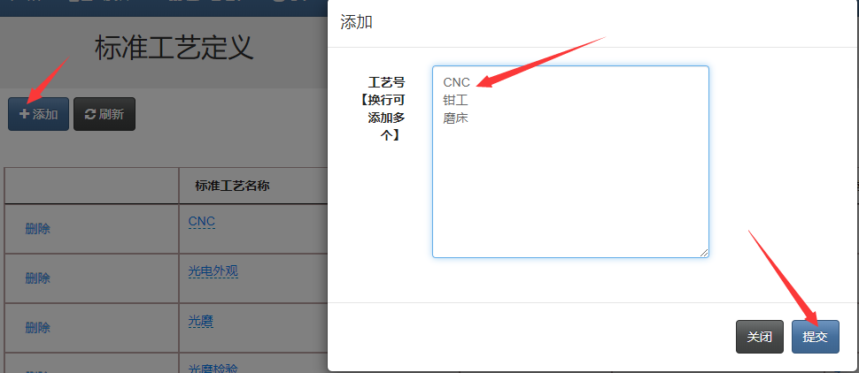
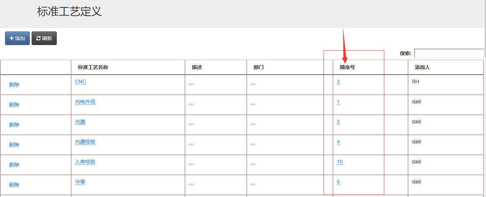
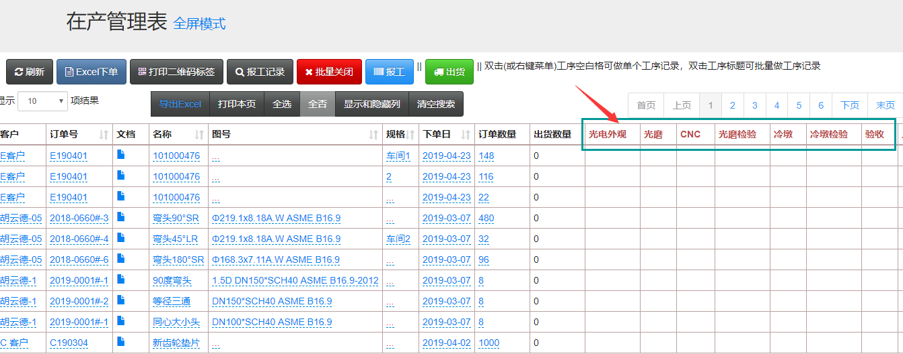

**V3生产管理系统的进度表**

## 自定义工艺及工艺顺序
点击“基础基料”-“自定义工艺”，来到添加工艺名称的页面，

点击“添加”，在输入框输入工序名称，回车代表输入另一个工序名称。也可以复制excel表的粘贴过来。这里的添加是为后面报工操作选择做哪个工序用的。输入完后，点击“提交”完成添加。

添加好后，右边有个列“顺序号”，这个是用来自定义排列工序顺序用的，只需要点击数字，编辑一下，按照自然数排列，自定义把工艺的先后顺序排好。这里的设置会影响在产管理表的工序排列。

切换到在产管理表页面查看一下效果




