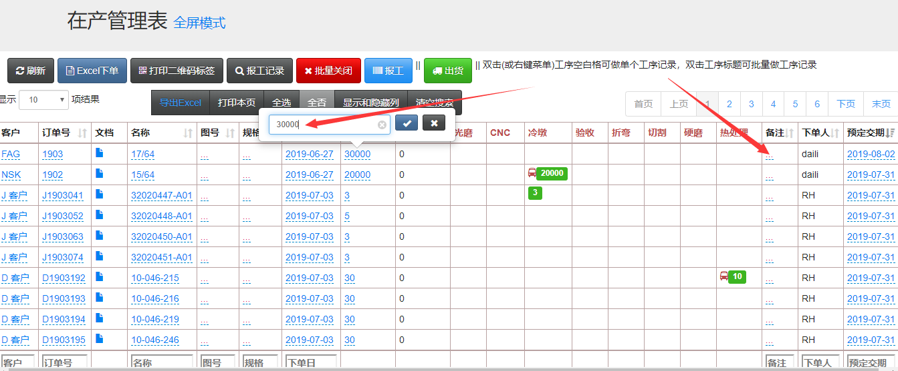

**V3生产管理系统的进度表**

## 修改订单的方法
### 进入在产管理表
- 点击“在产管理表”，来到在产管理表页面，

- 页面中，只要是带有虚线的文字，可以直接点击后进行修改，比如点击“订单数量”的数字，直接修改后点击√，或者回车就可以保存了。当然这些都是有权限才能操作的。

- 用户管理页面有权限设置，其中拥有“生产计划浏览”和“做生产计划”权限就可以对订单进行修改。如果需要控制不让修改，那么只给“生产计划浏览”权限既可。

- 比如设置车间1账号只有“生产计划浏览”权限，然后登录车间1的账号，看到订单的信息都是黑色字体，就无法编辑了。

