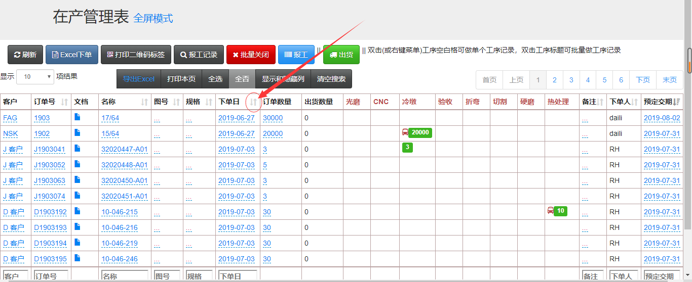

**V3生产管理系统的进度表**

## 修改订单的方法
### 进入在产管理表
点击“在产管理表”，来到在产管理表页面，

页面中，只要是带有虚线的文字，可以直接点击后进行修改，比如点击“订单数量”的数字，直接修改后点击√，或者回车就可以保存了。淡当然这些都是有权限才能操作的。
### 排序
表头中带有上下箭头的图标，就说明这一列可以手动排序，点击箭头图标，就可以排序，就和excel的排序一样的。

### 搜索
在表格的最下方，有一些输入框，是用来手动搜索的。比如要搜索客户，输入D回车，就会把带有D的客户搜索出来。

### 隐藏不要的列
每个人的账号，可以根据自己的需要，把一些不需要的列隐藏掉。具体操作是，点击“显示和隐藏列”，自定义选择需要隐藏的列名字。白色的代表要隐藏的，蓝色的代表要显示的列。

