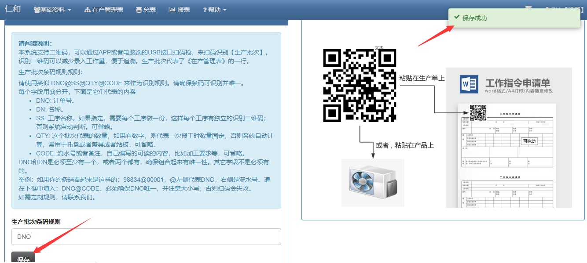

### 自己定义二维码生成规则

- 定义二维码规则

> V3为了方便客户更自由的制定二维码的定义，推出了几种组合来定义二维码：DNO@SS@QTY@CODE

- DNO：代表在产管理表的订单号，也是区分二维码唯一性的唯一依据。当然，订单号是表头的内容，是可以根据客户具体情况来修改成其他内容的。

- DN：代表名称，其实就是系统设置里订单的“产品名称标题”的内容，这个内容时可以自己进行修改的。

- SS：代表工序名称，如果指定，需要每个工序做一份，这样每个工序有独立的识别二维码；否则需要在扫码前选择好工序。可省略。

- QTY: 这个批次代表的数量，如果有数字，则代表一次报工时数量固定，否则系统自动计算，常用于托盘或者盛具或者站板。可省略。

- CODE: 流水号或者备注，自己编写的可读的内容，比如加工要求等，可省略。

- 在生产批次条码规则的输入框输入定义后，保存一下就可以了。

