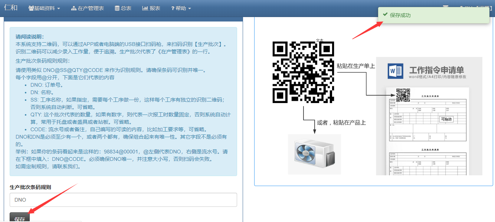
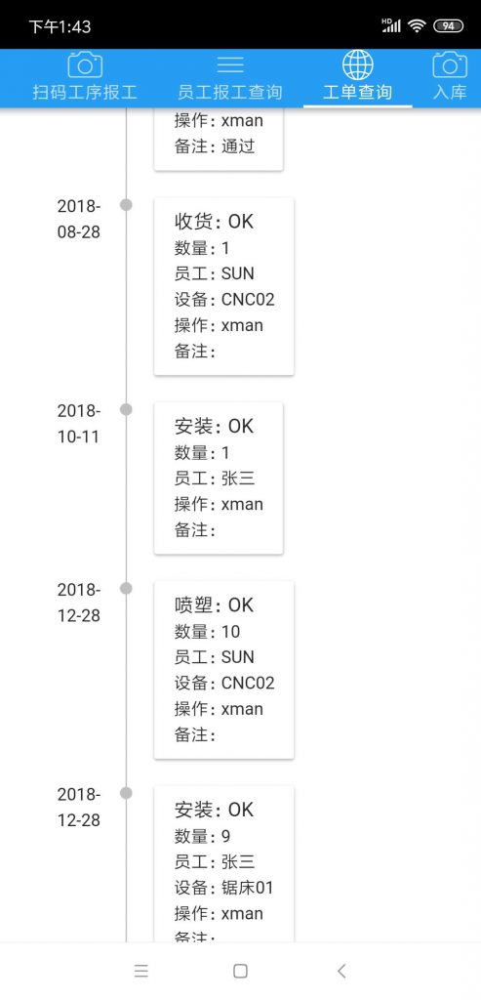

### 一码跟踪到底

> 一码跟踪就是用一个二维码标识一个或者一批产品，可以用来查询生产进度和报工、发货记录。

> 在速易天工V3生产管理软件中，从下单开始就给产品一个唯一的二维码。

> 首先我们需要一些设备支持：

- 标签打印机
- 手机APP，与配套软件一起回提供。用来报工时扫码用。

> 然后通过打印机打印出二维码，贴在产品，或者生产指令单，或者出货标签上面。

### 通过手机APP报工，记录生产过程

- 报工，就是工序做出来后用app扫码的方式，记录工序的生产结果，比如数量，谁做的，合格多少报废多少返修多少，还有什么异常信息，这些内容可以通过扫码后的记录框录入，便于追溯。通过二维码，可以在事后，通过手机查询一个产品或一个生产批次的过程。

